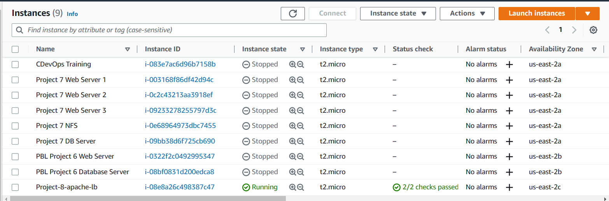

# (STEP 18) PROJECT 8: LOAD BALANCER SOLUTION WITH APACHE

After completing Project-7 you might wonder how a user will be accessing each of the webservers using 3 different IP addreses or 3 different DNS names. You might also wonder what is the point of having 3 different servers doing exactly the same thing.

When we access a website in the Internet we use an URL and we do not really know how many servers are out there serving our requests, this complexity is hidden from a regular user, but in case of websites that are being visited by millions of users per day (like Google or Reddit) it is impossible to serve all the users from a single Web Server (it is also applicable to databases, but for now we will not focus on distributed DBs).

Each URL contains a domain name part, which is translated (resolved) to IP address of a target server that will serve requests when open a website in the Internet. Translation (resolution) of domain names is perormed by DNS servers, the most commonly used one has a public IP address 8.8.8.8 and belongs to Google. You can try to query it with nslookup command:


```
nslookup 8.8.8.8
Server:  UnKnown
Address:  103.86.99.99

Name:    dns.google
Address:  8.8.8.8
```

When you have just one Web server and load increases – you want to serve more and more customers, you can add more CPU and RAM or completely replace the server with a more powerful one – this is called "vertical scaling". This approach has limitations – at some point you reach the maximum capacity of CPU and RAM that can be installed into your server.

Another approach used to cater for increased traffic is "horizontal scaling" – distributing load across multiple Web servers. This approach is much more common and can be applied almost seamlessly and almost infinitely (you can imagine how many server Google has to serve billions of search requests).

Horizontal scaling allows to adapt to current load by adding (scale out) or removing (scale in) Web servers. Adjustment of number of servers can be done manually or automatically (for example, based on some monitored metrics like CPU and Memory load).

Property of a system (in our case it is Web tier) to be able to handle growing load by adding resources, is called "Scalability".

In our set up in Project-7 we had 3 Web Servers and each of them had its own public IP address and public DNS name. A client has to access them by using different URLs, which is not a nice user experience to remember addresses/names of even 3 server, let alone millions of Google servers.

In order to hide all this complexity and to have a single point of access with a single public IP address/name, a Load Balancer can be used. A Load Balancer (LB) distributes clients’ requests among underlying Web Servers and makes sure that the load is distributed in an optimal way.


In this project we will enhance our Tooling Website solution by adding a Load Balancer to disctribute traffic between Web Servers and allow users to access our website using a single URL.

Task
Deploy and configure an Apache Load Balancer for Tooling Website solution on a separate Ubuntu EC2 intance. Make sure that users can be served by Web servers through the Load Balancer.

To simplify, let us implement this solution with 2 Web Servers, the approach will be the same for 3 and more Web Servers.


Prerequisites
Make sure that you have following servers installed and configured within Project-7:

1. Two RHEL8 Web Servers
2. One MySQL DB Server (based on Ubuntu 20.04)
3. One RHEL8 NFS server


## Begin Project

## CONFIGURE APACHE AS A LOAD BALANCER


1. Create an Ubuntu Server 20.04 EC2 instance and name it Project-8-apache-lb, so your EC2 list will look like this:


   

   Login to the terminal for the load balancer.

   


2. Open TCP port 80 on Project-8-apache-lb by creating an Inbound Rule in Security Group.

   - Go to AWS and select Project 8- apache lb and select security.

     

   - Click on security groups and then edit inbound rules.

     

   - Click on Add rule, change type to HTTP, Type to 0.0.0.0/0 and then save rules.

     

 

3. Install Apache Load Balancer on Project-8-apache-lb server and configure it to point traffic coming to LB to both Web Servers:


 
   ### Install apache2

     `sudo apt update`

     

     `sudo apt install apache2 -y`

     

     `sudo apt-get install libxml2-dev`

     Click Y when prompted.

     


     ### Enable following modules:

     ```
     sudo a2enmod rewrite
     sudo a2enmod proxy
     sudo a2enmod proxy_balancer
     sudo a2enmod proxy_http
     sudo a2enmod headers
     sudo a2enmod lbmethod_bytraffic
     ```

     


     
     ### Restart apache2 service
     `sudo systemctl restart apache2`

     


     Make sure apache2 is up and running.

     `sudo systemctl status apache2`

     

     Configure load balancing

   ```
   sudo vi /etc/apache2/sites-available/000-default.conf

   #Add this configuration into this section <VirtualHost *:80>  </VirtualHost>

   <Proxy "balancer://mycluster">
                  BalancerMember http://<WebServer1-Private-IP-Address>:80 loadfactor=5 timeout=1
                  BalancerMember http://<WebServer2-Private-IP-Address>:80 loadfactor=5 timeout=1
                  ProxySet lbmethod=bytraffic
                  # ProxySet lbmethod=byrequests
           </Proxy>

           ProxyPreserveHost On
           ProxyPass / balancer://mycluster/
           ProxyPassReverse / balancer://mycluster/

   #Restart apache server

   sudo systemctl restart apache2
   ```

   The screen below will be displayed after you run the command below.

   `sudo vi /etc/apache2/sites-available/000-default.conf`

   


   Copy the code provided above. Go to the terminal and press i for insert and paste the code  below CustomLog as shown on the screenshot below.


   


   The configuration above is telling the apache server to map the IP addresses of the web servers to the load balances to allow the webservers to be reached from the load balancer. the load balancer can distribute traffic to the web servers efficiently.

   Now you need to substitute with the actual Private IP addrsses.

   Go to AWS console , instances and details and get the Private IP addresses below from Project 7 Web server 1 and Project 7 Web Server 2. Ensure that Project 7 Web server 1 and 2 are running.

   Web Server 1 - 172.31.14.230

   Web server 2 - 172.31.7.66

   


   Save it by esc, shift:wq!

   


   Now restart apache server.

   `sudo systemctl restart apache2`

   

   Check status

   `sudo systemctl status apache2`

   

   *bytraffic* balancing method will distribute incoming load between your Web Servers according to current traffic load. We can control in which proportion the traffic must be distributed by *loadfactor* parameter.

   You can also study and try other methods, like: *bybusyness, byrequests, heartbeat*


Verify that our configuration works – try to access your LB’s public IP address or Public DNS name from your browser:

`http://<Load-Balancer-Public-IP-Address-or-Public-DNS-Name>/index.php`

Get the Public IP address for the Project 8- apache lb and replace it from the code. Below is how it will look like.

`http://52.14.18.141/index.php`


The below site will be displayed. If prompted to login user the credentials below;

username: admin
password:admin


Note: If in the Project-7 you mounted /var/log/httpd/ from your Web Servers to the NFS server – unmount them and make sure that each Web Server has its own log directory. 

Open two ssh/Putty consoles for both Web Servers and run following command:

`sudo tail -f /var/log/httpd/access_log`

In our case we do not have to do this.

Try to refresh your browser page `http://<Load-Balancer-Public-IP-Address-or-Public-DNS-Name>/index.php` several times and make sure that both servers receive HTTP GET requests from your LB – new records must appear in each server’s log file. The number of requests to each server will be approximately the same since we set loadfactor to the same value for both servers – it means that traffic will be disctributed evenly between them.

If you have configured everything correctly – your users will not even notice that their requests are served by more than one server.

Run the command below.


`sudo tail -f /var/log/httpd/access_log`


## Optional Step – Configure Local DNS Names Resolution

Sometimes it is tedious to remember and switch between IP addresses, especially if you have a lot of servers under your management.
What we can do, is to configure local domain name resolution. The easiest way is to use /etc/hosts file, although this approach is not very scalable, but it is very easy to configure and shows the concept well. So let us configure IP address to domain name mapping for our LB.


```
sudo vi /etc/hosts

#Add 2 records into this file with Local IP address and arbitrary name for both of your Web Servers

<WebServer1-Private-IP-Address> Web1
<WebServer2-Private-IP-Address> Web2

```

Below are the private IPS.

172.31.14.230 Web1

172.31.7.66 Web2

Run the command below and then add the 2 private IPs for Web server 1 and 2 as shown below. Do this in Project 8 apache lb.


`sudo vi /etc/hosts`

Save and exit using esc, shift :wq!


Now you can update your LB config file with those names instead of IP addresses.

BalancerMember http://Web1:80 loadfactor=5 timeout=1
BalancerMember http://Web2:80 loadfactor=5 timeout=1

Run the command below.

`sudo vi /etc/apache2/sites-available/000-default.conf`

Below is how it will look like when you open the config file.


After you update with Web1 and Web2, it will look like this. Save and quit using esc, shift:wq!


You can try to curl your Web Servers from LB locally curl http://Web1 or curl http://Web2 – it shall work.

Remember, this is only internal configuration and it is also local to your LB server, these names will neither be ‘resolvable’ from other servers internally nor from the Internet.


Complete.


   


